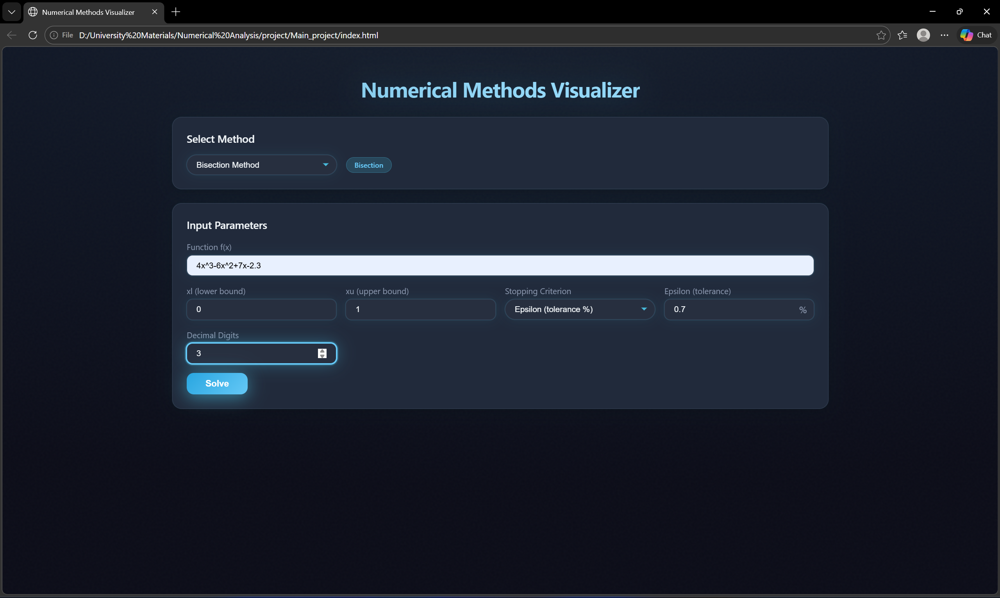
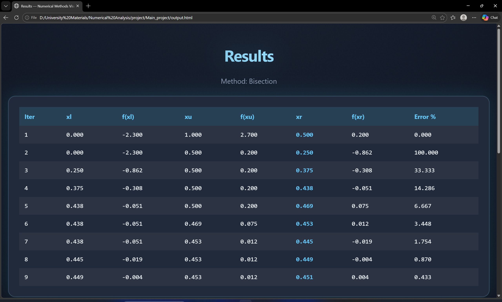
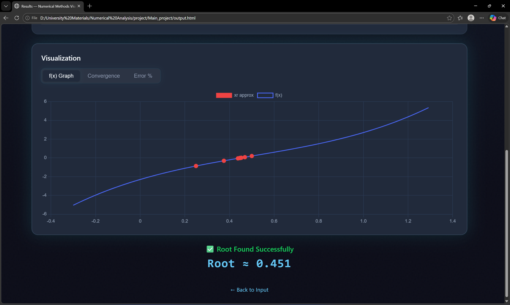
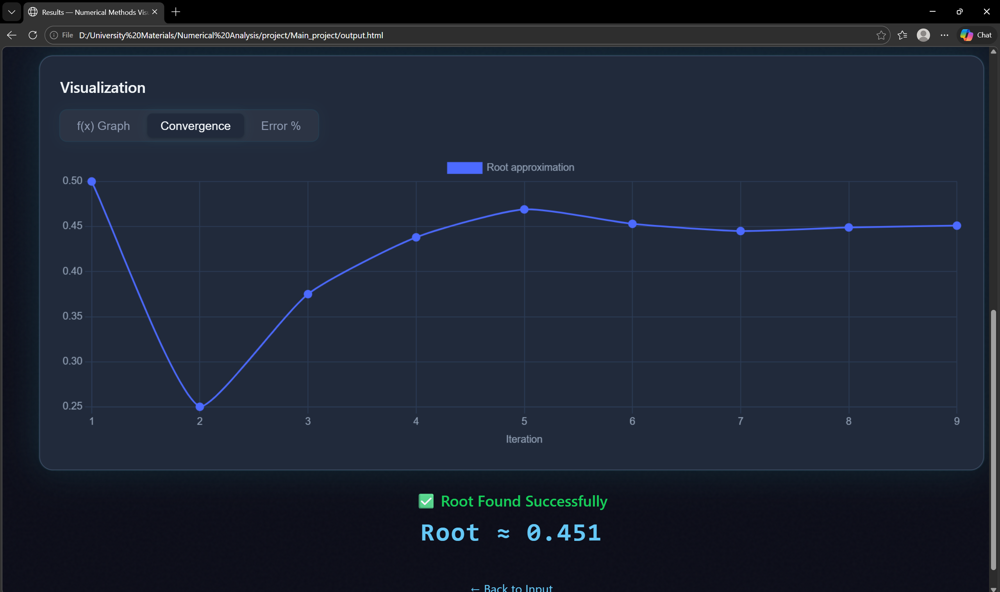
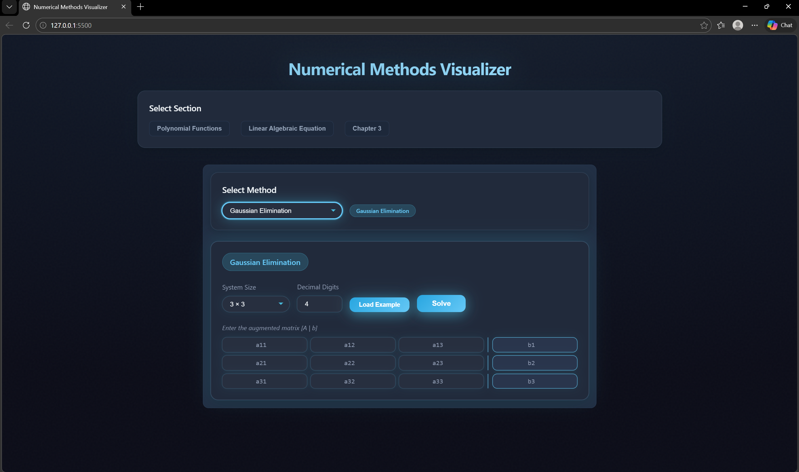
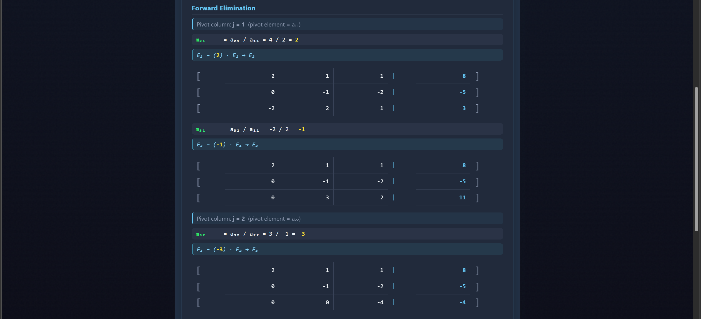

# Numerical Methods Visualizer

An interactive web-based tool for solving and visualizing **Numerical Methods**, including **root-finding algorithms** and **systems of linear algebraic equations**.

---

# Features

## 1️⃣ Root-Finding Methods
- Bisection Method
- False Position (Regula Falsi)
- Simple Fixed Point Iteration
- Newton-Raphson Method
- Secant Method

### Visualization
- Function graph **f(x)**
- Convergence chart
- Error percentage chart

### Stopping Criteria
- Epsilon (tolerance %)
- Maximum iterations

---

## 2️⃣ Linear Algebraic Equations

### Gaussian Elimination
- Interactive **Step-by-step solver**
- Press **Enter** to reveal each elimination step
- Shows **row operations** with exact multipliers
- Automatically generates **Upper Triangular Matrix**
- Performs **Back Substitution** to obtain the final solution

### Upcoming Methods
- LU Factorization
- PA = LU Factorization
- Gauss-Jordan
- Cramer's Rule

---

# Other Features

- Automatic conversion from **f(x) → g(x)** for Fixed Point
- Configurable **decimal precision**
- Matrix dimensions up to **6×6**
- Modern **Dark UI Design**
- Responsive interface
- Active method indicators

---

# Project Structure

```
project
│
├── index.html
├── output.html
├── style.css
├── script.js
├── README.md
│
├── input-page.png.png
├── iterations.png.png
├── graph.png.png
├── convergence.png.png
│
├── linear-methods-selection.png.png
├── gaussian-elimination-matrix.png.png
└── gaussian-elimination-steps.png.png
```

---

# Application Screenshots

## Root-Finding Input Page


## Iteration Results


## Function Graph


## Convergence Chart


---

# Gaussian Elimination Section

## Section Selection & Matrix Input


## Step-by-Step Elimination


## Final Matrix & Solution


---

# Technologies Used

- HTML5
- CSS3
- JavaScript
- math.js
- Chart.js

---

# How to Run

1. Download or clone the project
2. Open `index.html` in your browser
3. Choose the type of problem:
   - Root-Finding
   - Linear Algebra
4. Select the method
5. Enter the required parameters
6. Click **Solve**

For **Gaussian Elimination**, press **Enter** to reveal the next step.

---

# Example

## Root Finding Example

Function:

```
4x^3 - 6x^2 + 7x - 2.3
```

Using **Bisection Method**

```
xl = 0
xu = 1
epsilon = 0.7%
```

---

## Linear Algebra Example

Solve the following **3×3 system** using **Gaussian Elimination**:

```
2x + y - z = 8
-3x - y + 2z = -11
-2x + y + 2z = -3
```
